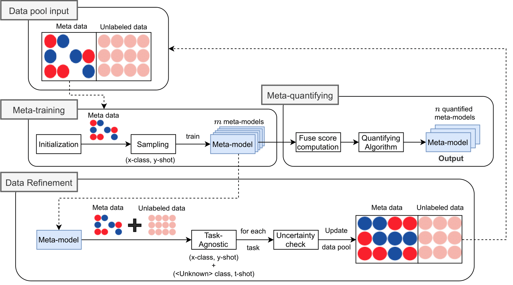
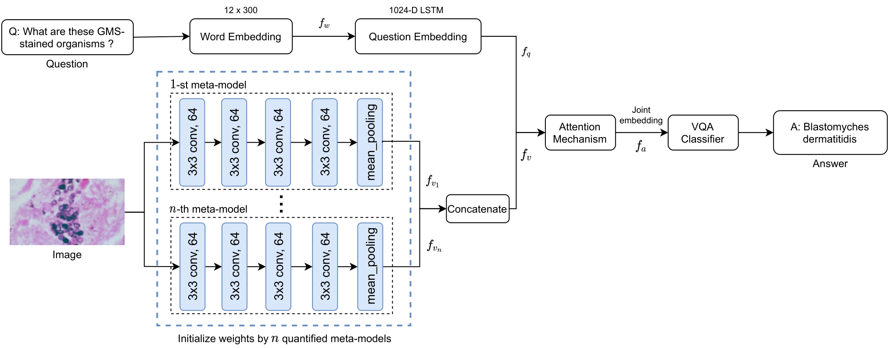

# Multiple Meta-model Quantifying for Medical Visual Question Answering (MMQ-VQA)

This repository is the implementation of `MMQ` for the visual question answering task in medical domain. Our proposal achieves superior accuracy in comparison with other state-of-the-art (sota) methods on two public medical VQA datasets: [PathVQA dataset](aa) and [VQA-RAD dataset](https://www.nature.com/articles/sdata2018251#data-citations).

* On PathVQA dataset, our model achieved **13.9%** for free-form and **63.8%** for yes/no quetions.
* On VQA-RAD dataset, our model achieved **56.9%** for open-ended and **75.7%** for close-ended questions.

For the detail, please refer to [link](https://arxiv.org/pdf/2105.08913.pdf). 

This repository is based on and inspired by @Binh D. Nguyen's [work](https://github.com/aioz-ai/MICCAI19-MedVQA). We sincerely thank for their sharing of the codes.

### Prerequisites

Please install dependence package by run following command:
```
pip install -r requirements.txt
```
## MMQ Progress


*<center>**Figure 1**: Multiple Meta-model Quantifying in medical VQA. Dotted lines denote looping steps, the number of loop equals to $m$ required meta-models.</center>*

### Preprocessing

Important: Before running any command lines, please run following command to access 'mmq_maml' folder:

```
$ cd mmq_maml
```

And now, you are in 'mmq_maml' folder.

* **PathVQA dataset for MMQ task** should be downloaded via [link](https://vision.aioz.io/f/19dbe6e3f4e940459053/?dl=1). The downloaded file should be extracted to `data/pathvqa_maml/` directory.
* **VQA-RAD dataset for MMQ task** should be downloaded via [link](https://vision.aioz.io/f/d88e9033805a4a1cbb19/?dl=1). The downloaded file should be extracted to `data/vqarad_maml/` directory.

### Traing MAML models with MMQ

Train MAML models with MMQ on PathVQA dataset:
```
$ sh run_pathVQA.sh
```
Train MAML models with MMQ on VQA-RAD dataset:
```
$ sh run_VQA_RAD.sh
```

## VQA Progress


*<center>**Figure 2**: Our VQA framework is designed to integrate robust image features extracted from multiple meta-models outputted from MMQ.</center>*

Important: For all VQA experiments, you should be in the 'root' folder.

### Preprocessing

##### PathVQA dataset for VQA task

All data should be downloaded via [link](https://vision.aioz.io/f/e0554683595c4e1d9a08/?dl=1). The downloaded file should be extracted to `data_PathVQA/` directory.

##### VQA-RAD dataset for VQA task

All data should be downloaded via [link](https://vision.aioz.io/f/d6fbe4cef5ac4b948e03/?dl=1). The downloaded file should be extracted to `data_RAD/` directory.

### Experimental results

MMQ results on PathVQA test set.

|            | m | n | Free-form | Yes/No | Overall |
|:----------:|:-:|:-:|:---------:|:------:|:-------:|
|    MAML    | - | - |    5.8    |  79.5  |   42.9  |
|    MEVF    | - | - |    8.1    |  81.4  |   47.1  |
|     MMQ    | 5 | 3 |    13.4   |  84.0  |   48.8  |
| MMQ + MEVF | 5 | 2 |    13.9   |  83.8  |   49.0  |

MMQ results on VQA-RAD test set.

|            | m | n | Open-ended | Close-ended | Overall |
|:----------:|:-:|:-:|:----------:|:-----------:|:-------:|
|    MAML    | - | - |    40.1    |     72.4    |   59.6  |
|    MEVF    | - | - |    43.9    |     75.1    |   62.7  |
|     MMQ    | 5 | 3 |    53.7    |     75.8    |    67   |
| MMQ + MEVF | 5 | 2 |    56.9    |     75.7    |   68.2  |

We have considered the recommendation of our reviewers about integrating MMQ into the MEVF. The setup further improves the overall performance in both PathVQA and VQA-RAD datasets. The number of parameters is only a 3% increase in comparison with our original MMQ. We please to provide the pre-trained weights of our state-of-the-art (SOTA) models in [here](#pretrained-models-and-testing) .

### Training

Train MMQ + MEVF model with Bilinear Attention Network on PathVQA dataset.
```
$ sh run_vqa_PathVQA.sh
```

Train MMQ + MEVF model with Bilinear Attention Network on VQA-RAD dataset.
```
$ sh run_vqa_VQA_RAD.sh
```

### Pretrained models and Testing

For our SOTA model on PathVQA dataset `MMQ_BAN_MEVF_pathVQA`. Please download the [link](https://vision.aioz.io/f/23897e70fdb443e9862d/?dl=1) and move to `saved_models/MMQ_BAN_MEVF_pathVQA/`. The trained `MMQ_BAN_MEVF_pathVQA` model can be tested in PathVQA test set via: 
```
$ sh run_test_PathVQA.sh
```
For our  SOTA model on VQA-RAD dataset `MMQ_BAN_MEVF_vqaRAD`. Please download the [link](https://vision.aioz.io/f/73f86d22c6b546a1afc9/?dl=1) and move to `saved_models/MMQ_BAN_MEVF_vqaRAD/`. The trained `MMQ_BAN_MEVF_vqaRAD` model can be tested in VQA-RAD test set via:
```
$ sh run_test_VQA_RAD.sh
```
The result json file can be found in the directory `results/`.

We also provides the pretrained meta-models and CDAE models for further investigation as belows:
* VQA-RAD:
    * The **MAML** models `data_RAD/maml/*.pth` is trained by using our MMQ source code.
    * The **CDAE** model `data_RAD/pretrained_ae.pth`.
* PathVQA:
    * The **MAML** models `data_PathVQA/maml/*.pth` is trained by using our MMQ source code.
    * The **CDAE** model `data_PathVQA/pretrained_ae.pth`.

### Citation

If you use this code as part of any published research, we'd really appreciate it if you could cite the following paper:

```
Updating
```

### License

MIT License

